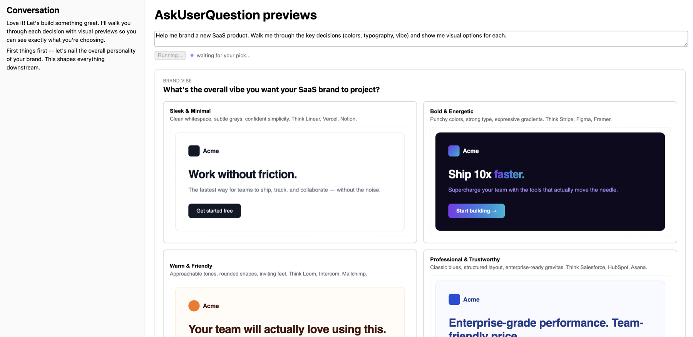

# AskUserQuestion HTML previews

Demonstrates HTML previews with the [`AskUserQuestion` tool](https://platform.claude.com/docs/en/agent-sdk/user-input#option-previews-type-script).

Normally when Claude asks a clarifying question, the user chooses from text labels. With previews, each option includes a rendered HTML fragment so the user can see the choice before making it.

The demo runs a branding assistant. Ask it to help brand a new product and Claude walks you through decisions (color palette, typography, vibe) one at a time, rendering each option as a live HTML mockup: sample UI, color swatches, type specimens. Click a card to pick, or type your own answer if none fit.



This is a one-shot demo: one prompt goes in, Claude asks its clarifying questions, then presents a final plan and ends. Claude includes an HTML preview on options where it helps (color palettes, layout choices) and omits it where it wouldn't (yes/no questions, plain text picks). The client renders both cases: cards with a preview box or just label + description.

**Stack:** The server is a Node.js HTTP server using the `ws` library for WebSocket communication and `tsx` for TypeScript execution. The client is a React 18 app built with Vite, using DOMPurify to sanitize preview HTML and react-markdown for rendering Claude's text output.

## Prerequisites

- **Node.js 18+**
- **Authentication** via one of:
  - An Anthropic API key ([get one here](https://console.anthropic.com/settings/keys)), or
  - An existing `claude login` session (the SDK runs the Claude CLI, so its stored OAuth credentials work here too)

## Setup

First, install the dependencies:

```bash
npm install
```

Next, set up authentication. **If you've already run `claude login`, skip this step** since the CLI's stored credentials will be picked up automatically.

Otherwise, create a `.env` file from the template.

```bash
cp .env.example .env
```

Then open `.env` and replace the placeholder value with your key.

Finally, start the dev server:

```bash
npm run dev
```

## Try the demo application

Open http://localhost:5173. The prompt field is prefilled with a branding assistant scenario. Click **Run** to start.

Claude will ask a series of clarifying questions, each with a set of preview cards showing rendered HTML mockups (color swatches, type specimens, sample UI). Click a card to pick that option, or type a free-text answer in the input below the cards.

Generating the previews can take a moment since each one is a full HTML fragment; the status line shows progress.

## Files

- [**`server.ts`**](server.ts): Node server. Calls `query()`, maps SDK stream events to status updates, and forwards `AskUserQuestion` to the browser via `canUseTool`.
- [**`client/App.tsx`**](client/App.tsx): React UI. Renders the current question's preview cards and the conversation log. See `QuestionView` for the preview rendering.
- [**`client/useAgentSocket.ts`**](client/useAgentSocket.ts): WebSocket connection, auto-reconnect, and message dispatch.

## How it works

Most of the code handles WebSocket transport, status indicators, markdown rendering, and layout. The parts specific to the preview feature are small and localized:

| Where | What |
|-------|------|
| [`server.ts` options block](server.ts#L90-L97) | `toolConfig.askUserQuestion.previewFormat: "html"` enables previews; `permissionMode: "plan"` and `tools: ["AskUserQuestion"]` make Claude actually use the tool |
| [`server.ts` `canUseTool`](server.ts#L98-L132) | Intercepts `AskUserQuestion`, forwards it to the browser, awaits the pick, returns `{ behavior: "allow", updatedInput: { questions, answers } }` |
| [`client/App.tsx` `QuestionView`](client/App.tsx#L97-L192) | Renders `opt.preview` with `dangerouslySetInnerHTML` + DOMPurify |

### SDK configuration

The server sets a custom [`systemPrompt`](server.ts#L73-L89) that replaces the default Claude Code instructions entirely, turning Claude into a branding assistant. (Use `systemPrompt` with `append` instead if you want to keep the defaults and add to them.) It also passes three [options that shape tool behavior](server.ts#L90-L97):

```ts
permissionMode: "plan",                                   // nudges Claude to ask before acting
tools: ["AskUserQuestion"],                               // only this tool is available
toolConfig: { askUserQuestion: { previewFormat: "html" } } // adds opt.preview to each option
```

`previewFormat: "html"` is the feature being demoed. Without it, options only have `label` and `description`. With it, Claude generates a styled `<div>` fragment for each option's `preview` field (the SDK strips `<script>` and `<style>` tags before your callback sees it).

The other two options make Claude actually reach for the tool. `permissionMode: "plan"` puts Claude in a requirements-gathering frame where it naturally asks clarifying questions. `tools: ["AskUserQuestion"]` restricts the toolset to just that one tool, so Claude has no choice but to ask questions rather than take actions like writing files or running commands.

### Server-to-browser round trip

The SDK spawns the Claude CLI as a subprocess, so `query()` and its `canUseTool` callback run on the server. This demo connects them to the browser over WebSocket:

1. Browser sends a prompt over WebSocket
2. Server calls [`query()`](server.ts#L69) and starts streaming
3. When Claude calls `AskUserQuestion`, [`canUseTool`](server.ts#L98) fires with the questions (including each `opt.preview` HTML)
4. Server forwards the question to the browser and [stores a promise resolver](server.ts#L121) in a `Map`
5. Browser [renders previews as cards](client/App.tsx#L97-L170) via `dangerouslySetInnerHTML` (sanitized with DOMPurify)
6. User clicks a card (or types a free-text answer); browser sends the label back
7. Server [resolves the promise](server.ts#L44), `canUseTool` returns the answer in `updatedInput.answers`, SDK continues

```
browser ──prompt──▶ server ──query()──▶ SDK
                              │
                    canUseTool fires with
                    questions[].options[].preview  ◀── HTML fragment
                              │
browser ◀─question── server (awaits...)
   │
  user clicks a card
   │
browser ──answer──▶ server ──resolves canUseTool──▶ SDK continues
```

The server logs each stream event (`[stream] system/init`, `block: tool_use (AskUserQuestion)`, etc.) so you can watch the flow in the terminal.

## Extend the demo

This demo covers one prompt-to-plan flow. Here are a few ways to build on it using other SDK features.

**Follow-up chat.** Switch to [streaming input](https://platform.claude.com/docs/en/agent-sdk/streaming-vs-single-mode) so the user can keep talking after the final plan: "actually make the purple darker", "show me that with a serif instead". The `canUseTool` handler stays the same; you just change how you feed prompts in.

**Richer answer types.** `AskUserQuestion` tops out at 4 options per question and labels are short strings. For sliders, color pickers, or multi-field forms, define a [custom tool](https://platform.claude.com/docs/en/agent-sdk/custom-tools) whose input schema matches what your UI collects. The round-trip pattern (server waits on a promise, browser resolves it) is identical.

**Notify when Claude is waiting.** Add a [`PermissionRequest` hook](https://platform.claude.com/docs/en/agent-sdk/hooks#available-hooks) that fires a Slack message, push notification, or email whenever `canUseTool` is about to block. Useful if the branding flow runs async and the user isn't watching the tab.

**Multi-select.** `AskUserQuestion` supports `multiSelect: true` per question. This demo only sends back one label per pick; to support it, change `pick()` to accumulate labels and add a "Done" button, then join them with `", "` in the answer value.

## See also

- [AskUserQuestion docs](https://platform.claude.com/docs/en/agent-sdk/user-input#option-previews-type-script)
- [Plan mode](https://platform.claude.com/docs/en/agent-sdk/permissions#plan-mode-plan)
